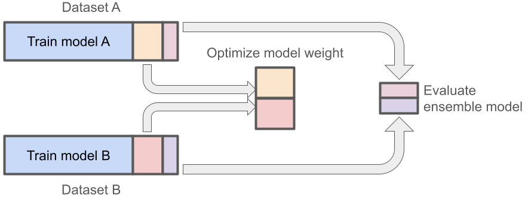

# Model Development Plan for the ALERT Project

## Overview

This document outlines the development plan for the machine learning model in
the ALERT project. Our approach involves a performance-weighted ensemble method
using Random Forest algorithms, aimed at proving the superiority of this method
over individual models.

## Data Division Strategy

Each dataset used in the ALERT project will be divided into four distinct
sections, serving different purposes in the model development process:

1. **Combined Training and Hyperparameter Optimization Set (85%)**:
   - This combined set forms the majority of the data.
   - Use K-fold cross-validation within this set to:
     - Train the model on different subsets of data.
     - Simultaneously tune hyperparameters.
   - This method ensures that every data point is used for both training and
   validation at some point, maximizing data efficiency
2. **Performance Weight Optimization Set (10%)**:
   - This set is crucial for adjusting the weights of individual models in our
   ensemble approach.
   - We accumulate this set from the corresponding portions of each dataset we
   use. By pooling data from all datasets, we ensure a diverse and comprehensive
   set for fine-tuning the ensemble model’s performance weights.
   - This approach allows us to create a balanced and effective weighting system
   that reflects the strengths and weaknesses of each individual model.
3. **Evaluation Set (5%)**:
   - Reserved for the final evaluation of the overall model’s performance.
   - Similar to the Performance Weight Optimization Set, the Evaluation Set is
   also an accumulation from the same section of all datasets.
   - This accumulated set provides a broad and unbiased basis for assessing how
   well the ensemble model generalizes to new, unseen data, ensuring a rigorous
   evaluation of its real-world effectiveness.

### Importance of Accumulated Sets

- **Diversity and Representativeness**: Accumulating these sets across all
datasets enhances the diversity and representativeness of the data, crucial for
robust model evaluation and performance weight optimization.
- **Preventing Bias**: It helps in preventing biases that might arise if these
sets were drawn from a single dataset.
